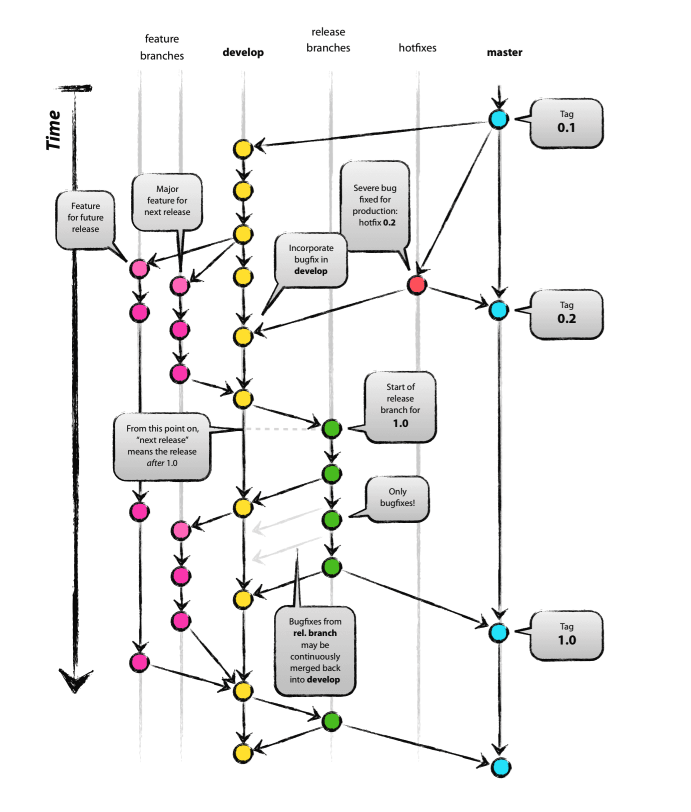

## Contributing

Our project welcomes external contributions.

This project uses the "Git flow" Git branching strategy for development and release management.



To contribute code or documentation, you should first create a fork of this repo, and once the feature is complete, submit a [pull request](https://github.com/IBM/operator-collection-sdk/pulls) to the `develop` branch.

Please refer to the [Development Guide](./resources/docs/development-guide.md), for further guidance during development.

### Proposing new features

If you would like to implement a new feature, please [raise an issue](https://github.com/IBM/operator-collection-sdk-vscode-extension/issues) before sending a pull request so the feature can be discussed. This is to avoid you wasting your valuable time working on a feature that the project developers are not interested in accepting into the code
base.

### Fixing bugs

If you would like to fix a bug, please [raise an issue](https://github.com/IBM/operator-collection-sdk-vscode-extension/issues) before sending a pull request so it can be tracked.

### Merge approval

The project maintainers use LGTM (Looks Good To Me) in comments on the code review to indicate acceptance. A change requires LGTMs from one of the maintainers of each component affected.

For a list of the maintainers, see the [MAINTAINERS.md](MAINTAINERS.md) page.

## Legal

Each source file must include a license header for the Apache Software License 2.0. Using the SPDX format is the simplest approach. e.g.

```
/*
 * Copyright 2023 IBM Inc. All rights reserved
 * SPDX-License-Identifier: Apache-2.0
 */
```

We have tried to make it as easy as possible to make contributions. This applies to how we handle the legal aspects of contribution. We use the same approach - the [Developer's Certificate of Origin 1.1 (DCO)](https://github.com/hyperledger/fabric/blob/master/docs/source/DCO1.1.txt) - that the Linux® Kernel
[community](https://elinux.org/Developer_Certificate_Of_Origin) uses to manage code contributions.

We simply ask that when submitting a patch for review, the developer must include a sign-off statement in the commit message.

Here is an example Signed-off-by line, which indicates that the submitter accepts the DCO:

```
Signed-off-by: John Doe <john.doe@example.com>
```

You can include this automatically when you commit a change to your local git repository using the following command:

```
git commit -s
```
