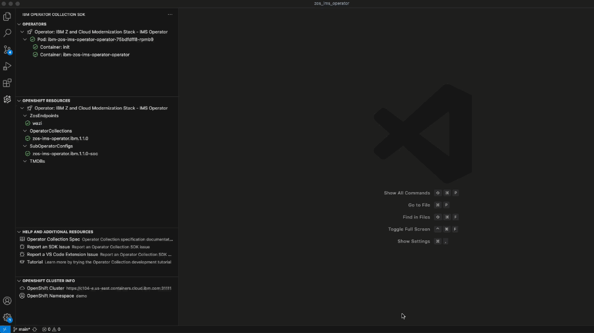

# IBM Operator Collection SDK for VS Code

The IBM Operator Collection SDK extension simplifies the Operator Collection development experience by allowing you to manage the deployment of your operator in OpenShift, and the ability to debug direcly from your VS Code editor.

## Features

## Deploy your operator to OpenShift with single-click actions

Single-click actions to Create, Re-deploy, and Delete your operator in OpenShift.


## Monitor your operator status and resources directly from your VS Code editor

- Display the status of the operator pod, and each container within the pod.
- Download and view container logs directly from your VS Code editor.



- Display the status of the OpenShift resources created to generate your operator (`OperatorCollections`, `SubOperatorConfigs`, `ZosEndpoints`).
- Create and monitor the Custom Resources for your operator.


## Manage your OpenShift cluster connection and project

Configure your OpenShift server URL, and select your OpenShift Project directly from your VS Code editor


## Trouble Shooting

If you experience issues with `urlopen error [SSL: CERTIFICATE_VERIFY_FAILED]`, or similar issues, you may need to install and use SSL Certificates before running this extension.

To install SSL Certificates in Python, you can install the [`certifi`](https://pypi.org/project/certifi/) package via `pip`:

```cmd
pip install certifi
```

Alternatively, you can navigate to your python folder and run the `Certificates` command from your terminal:

```cmd
cd <PATH_TO_PYTHON>
./Install\ Certificates.command
```

## How to contribute

Check out the [contributor documentation](CONTRIBUTING.md).

## Copyright

© Copyright IBM Corporation 2023.
